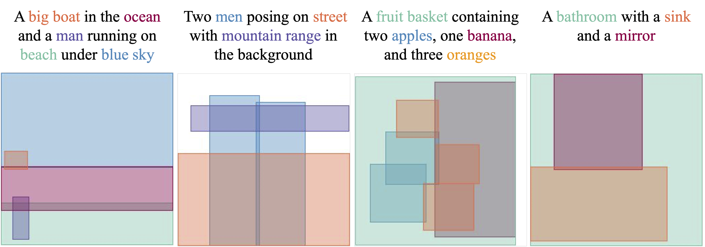

<h1 align="center"> 🎨 Lay-Your-Scene</a>: Natural Scene Layout Generation with Diffusion Transformers</h1>


<p align="center">
    <a href="https://arxiv.org/abs/2505.04718"></a>
    <a href="https://mlpc-ucsd.github.io/Lay-Your-Scene/" target="_blank">
        </a>
</p>

<p align="center">
    <a href="https://dsrivastavv.github.io"><strong><ins>Divyansh Srivastava </ins></strong></a>
    ·
    <a href="https://xzhang.dev"><strong><ins>Xiang Zhang</ins></strong></a>
    ·
    <a href=""><strong><ins>He Wen</ins></strong></a>
    ·
    <a href=""><strong><ins>Chenru Wen</ins></strong></a>
    ·
    <a href="https://pages.ucsd.edu/~ztu/"><strong><ins>Zhuowen Tu</ins></strong></a>
</p>

<div align="center">

</div>

---

## 📖 Abstract

> We present Lay-Your-Scene (shorthand LayouSyn), a novel text-to-layout generation pipeline for natural scenes. Prior scene layout generation methods are either closed-vocabulary or use proprietary large language models for open-vocabulary generation, limiting their modeling capabilities and broader applicability in controllable image generation. In this work, we propose to use lightweight open-source language models to obtain scene elements from text prompts and a novel aspect-aware diffusion Transformer architecture trained in an open-vocabulary manner for conditional layout generation. Extensive experiments demonstrate that LayouSyn outperforms existing methods and achieves state-of-the-art performance on challenging spatial and numerical reasoning benchmarks. Additionally, we present two applications of LayouSyn. First, we show that coarse initialization from large language models can be seamlessly combined with our method to achieve better results. Second, we present a pipeline for adding objects to images, demonstrating the potential of LayouSyn in image editing applications.


## 🔥 Updates

- **2025-09-30**: Inference and evaluation code is released
- **2025-06-25**: Paper accepted at ICCV 2025 🎉🎉

## 🚀 Quick Start

### Installation

Clone the repository and install the requirements

```bash
conda env create -f environment.yml
conda activate LayYourScene
```

### Demo

1. Download trained models and configs from HuggingFace:

```bash
git clone https://huggingface.co/dsrivastavv/Lay-Your-Scene saved_models
```

2. Run `demo.py` to generate layouts with Lay-Your-Scene followed by [`GLIGEN`](https://gligen.github.io) for converting generated layouts to image:

```bash
python demo.py --ckpt saved_models/grit/model.pt \
                --ckpt-config saved_models/grit/config.json \
                --caption "A big boat in the ocean and a man running on beach under blue sky"
```

The generated layout is saved at root directory as `scene_layout.png` and the generated image is saved as `scene.png`.

## 📊 Evaluation

1. **Layout-FID**: Draws the layout as an image and map each object to a specific color following document layout generation literature taking into account semantic similarity between different objects based on CLIP similarity.

```bash
python -m layout_evaluation.evaluate \
    --evaluation_name coco_grounded_lfid \
    --layout_file results/coco_evaluation/layousyn/output.json \
    --evaluation_dir results/coco_evaluation/layousyn
```

or you can generate the layouts from trained model and evaluate by running below command: 

```bash
python -m layousyn.evaluation.coco_evaluation \
    --ckpt saved_models/coco_grounded/model.pt \
    --ckpt-config saved_models/coco_grounded/config.json \
    --num-sampling-step 15 \
    --cfg-scales 2.0 \
    --eval-dir results/coco_evaluation/layousyn \
    --partial-file
```

2. **NSR-1K evaluation**: Evaluates the generated layouts on spatial and counting metrics using the [NSR-1K](https://arxiv.org/abs/2305.15393) benchmark.

```bash
# Spatial evaluation
python -m layout_evaluation.evaluate \
    --evaluation_name nsr_spatial \
    --layout_file results/nsr_1k/layousyn/spatial.json

# Counting evaluation
python -m layout_evaluation.evaluate \
    --evaluation_name nsr_counting \
    --layout_file results/nsr_1k/layousyn/counting.json
```

or you can generate the layouts from trained model and evaluate by running below command: 

```bash
python -m layousyn.evaluation.nsr_counting_evaluation \
    --ckpt saved_models/coco_grounded/model.pt \
    --ckpt-config saved_models/coco_grounded/config.json \
    --num-sampling-step 15 \
    --cfg-scales 2.0 \
    --eval-dir results/nsr_1k/layousyn/counting

python -m layousyn.evaluation.nsr_spatial_evaluation \
    --ckpt saved_models/coco_grounded/model.pt \
    --ckpt-config saved_models/coco_grounded/config.json \
    --num-sampling-step 15 \
    --cfg-scales 2.0 \
    --eval-dir results/nsr_1k/layousyn/spatial
```

3. **GLIP**: Please follow the instructions in [LAYOUTGPT](https://github.com/weixi-feng/LayoutGPT) for generating images from layouts using GLIGEN and detecting objects using GLIP.


## 🤝 Acknowledgements

We deeply appreciate the contributions of the following projects:

- [LayoutGPT](https://layoutgpt.github.io)
- [DiT](https://github.com/facebookresearch/DiT)

We would also like to thank <a href="https://xzhang.dev">Xiang Zhang</a>, <a href="https://scholar.google.com/citations?user=LE6bioEAAAAJ&hl=en">Ethan Armand</a>, and <a href="https://zeyuan-chen.com">Zeyuan Chen></a> for their valuable feedback and insightful discussions.

## ✒️ Citation

If you find our work useful, please consider citing:
```bibtex
@misc{srivastava2025layyourscenenaturalscenelayout,
      title={Lay-Your-Scene: Natural Scene Layout Generation with Diffusion Transformers}, 
      author={Divyansh Srivastava and Xiang Zhang and He Wen and Chenru Wen and Zhuowen Tu},
      year={2025},
      eprint={2505.04718},
      archivePrefix={arXiv},
      primaryClass={cs.CV},
      url={https://arxiv.org/abs/2505.04718}, 
}
```